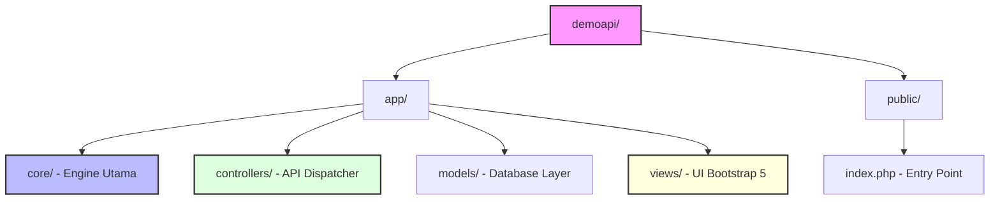

<div align="center">

<!-- ANIMATED HEADER TYPING -->


<p align="center">
  <strong>High-performance Native PHP Payment Wrapper Engine</strong>
</p>

<!-- DYNAMIC ANIMATED BADGES -->
<a href="https://php.net">
  
</a>
<a href="https://getbootstrap.com">
  
</a>
<a href="https://mysql.com">
  
</a>
<a href="#">
  
</a>

<br />
<hr style="border: 1px dashed #dee2e6" />

</div>

## Pengenalan Singkat

Platform Payment Gateway Wrapper canggih berbasis PHP Native MVC yang dirancang khusus untuk menjembatani aplikasi e-commerce Anda dengan ekosistem multi-versi YoBasePay Gateway (V1 / V2 / V3) secara aman, real-time, dan otomatis.

---

## Fitur Unggulan

<details open>
<summary><b>Klik Untuk Melihat Keunggulan Platform</b></summary>
<br/>

*   Routing Clean URL: Didukung oleh engine `.htaccess` pintar yang menghilangkan ekstensi berkas secara otomatis.
*   Multi-Proyek Merchant: Buat ratusan proyek dengan kredensial `Project Key (PRJ_)` terisolasi.
*   Target Versi Dinamis: Tentukan secara spesifik backend API tujuan (V1, V2, atau V3) pada setiap proyek aplikasi.
*   Validasi Webhook HMAC: Enkripsi tandatangan searah SHA256 menjamin notifikasi sukses 100% otentik.
*   Native MVC Engine: Dibuat dari nol, nol dependensi pihak ketiga (Zero bloating), berkinerja super kilat!
*   SVG Captcha Generator: Pelindung keamanan formulir pendaftaran anti-bot yang 100% bebas ketergantungan ekstensi server.
</details>

---

## Pratinjau Arsitektur Folder



---

## Langkah Pemasangan

### Persiapan Sistem
*   Aktifkan Laragon / XAMPP (PHP 7.4 - 8.2+).
*   Pastikan modul Apache Rewrite (`mod_rewrite`) aktif.

### Inisialisasi Database
1.  Buka manajer basis data Anda (HeidiSQL / phpMyAdmin).
2.  Eksekusi skema terstruktur lengkap dari file [database.sql](file:///c:/laragon/www/demoapi/database.sql).

### Konfigurasi Kredensial Lokal
Buka berkas konfigurasi Anda:
```php
// file: app/config/config.php
define('DB_HOST', 'localhost');
define('DB_NAME', 'demoapi_db');
define('DB_USER', 'root');
define('DB_PASS', ''); // sesuaikan password database Anda
```

---

## API Command Reference Center

<div align="center">
  
</div>

| Metode | Endpoint | Fungsi & Keterangan |
| :--- | :--- | :--- |
| `POST` | `/api/v1/payments/create` | Membuat tautan & Gambar QRIS baru. |
| `GET` | `/api/v1/payments/status/{id}` | Polling / Cek status pembayaran spesifik. |
| `POST` | `/api/webhook` | Penerima callback gerbang YoBasePay. |

<br/>

#### Snippet cURL Pembuatan QRIS Instan:
```bash
curl -X POST "http://localhost/demoapi/api/v1/payments/create" \
-H "Authorization: Bearer YOUR_API_KEY" \
-H "Content-Type: application/json" \
-d '{
  "amount": 25000,
  "ref_id": "INV-UNIQUE-REF-123",
  "customer_name": "Budi Santoso"
}'
```

---

## Verifikasi Tanda Tangan Webhook (HMAC-SHA256)
Berikut visualisasi alur logika otentikasi callback pada server backend Anda:

```php
<?php
$rawPayload = file_get_contents('php://input');
$headers = apache_request_headers();
$receivedSig = $headers['X-DemoAPI-Signature'] ?? '';

// Buat hash pencocokan lokal menggunakan API Key Anda
$expectedSig = hash_hmac('sha256', $rawPayload, 'KUNCI_API_MERCHANT_ANDA');

if (hash_equals($expectedSig, $receivedSig)) {
    // LUNAS! Data otentik & Terverifikasi secara sah.
    echo json_encode(["status" => "OK"]);
} else {
    http_response_code(401);
}
?>
```

---

<div align="center">

### Dibuat dengan Penuh Semangat


</div>
